---
## Front matter
title: "Лабораторная работа №2"
subtitle: "Простейший вариант"
author: "Атанесов Даниил Николаевич"

## Generic otions
lang: ru-RU
toc-title: "Содержание"

## Bibliography
bibliography: bib/cite.bib
csl: pandoc/csl/gost-r-7-0-5-2008-numeric.csl

## Pdf output format
toc: true # Table of contents
toc-depth: 2
lof: true # List of figures
lot: true # List of tables
fontsize: 12pt
linestretch: 1.5
papersize: a4
documentclass: scrreprt
## I18n polyglossia
polyglossia-lang:
  name: russian
  options:
	- spelling=modern
	- babelshorthands=true
polyglossia-otherlangs:
  name: english
## I18n babel
babel-lang: russian
babel-otherlangs: english
## Fonts
mainfont: PT Serif
romanfont: PT Serif
sansfont: PT Sans
monofont: PT Mono
mainfontoptions: Ligatures=TeX
romanfontoptions: Ligatures=TeX
sansfontoptions: Ligatures=TeX,Scale=MatchLowercase
monofontoptions: Scale=MatchLowercase,Scale=0.9
## Biblatex
biblatex: true
biblio-style: "gost-numeric"
biblatexoptions:
  - parentracker=true
  - backend=biber
  - hyperref=auto
  - language=auto
  - autolang=other*
  - citestyle=gost-numeric
## Pandoc-crossref LaTeX customization
figureTitle: "Рис."
tableTitle: "Таблица"
listingTitle: "Листинг"
lofTitle: "Список иллюстраций"
lotTitle: "Список таблиц"
lolTitle: "Листинги"
## Misc options
indent: true
header-includes:
  - \usepackage{indentfirst}
  - \usepackage{float} # keep figures where there are in the text
  - \floatplacement{figure}{H} # keep figures where there are in the text
---

# Цель работы

Изучить идеологию и применение средств
контроля версий. Приобрести практические навыки по работе с
системой git.
Цель данного шаблона упростить подготовку отчетов по лабораторным работам.Модифицируя данный шаблон, студенты смогут без труда подготовить отчет по лабораторным работам а также познакомиться с основными возможностями Markdown 

# Задание

 1.Создайте отчет по выполнению лабораторной работы в соответствующем каталоге рабочего пространства (labs>lab03>report) 

# Теоретическое введение

Здесь описываются теоретические аспекты, связанные с выполнением работы.

Например, в табл. [-@tbl:std-dir] приведено краткое описание стандартных каталогов Unix.

: Описание некоторых каталогов файловой системы GNU Linux {#tbl:std-dir}

| Имя каталога | Описание каталога                                                                                                          |
|--------------|----------------------------------------------------------------------------------------------------------------------------|
| `/`          | Корневая директория, содержащая всю файловую                                                                               |
| `/bin `      | Основные системные утилиты, необходимые как в однопользовательском режиме, так и при обычной работе всем пользователям     |
| `/etc`       | Общесистемные конфигурационные файлы и файлы конфигурации установленных программ                                           |
| `/home`      | Содержит домашние директории пользователей, которые, в свою очередь, содержат персональные настройки и данные пользователя |
| `/media`     | Точки монтирования для сменных носителей                                                                                   |
| `/root`      | Домашняя директория пользователя  `root`                                                                                   |
| `/tmp`       | Временные файлы                                                                                                            |
| `/usr`       | Вторичная иерархия для данных пользователя                                                                                 |

Более подробно об Unix см. в [@gnu-doc:bash;@newham:2005:bash;@zarrelli:2017:bash;@robbins:2013:bash;@tannenbaum:arch-pc:ru;@tannenbaum:modern-os:ru].

# Выполнение лабораторной работы

1) Сначала сделаем предварительную конфигурацию git.

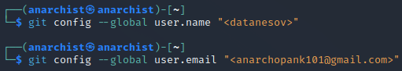{ #fig:001 width=90% }

2) Настроим utf-8 в выводе сообщений git.

{ #fig:002 width=90% }

3) Зададим имя начальной ветки (будем называть ее master).

![master] (image/ф3.png){ #fig:003 width=90% }

4) Параметр autocrlf: 

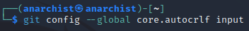{ #fig:004 width=90% }

5) Параметр safecrlf:

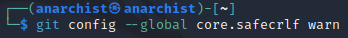{ #fig:005 width=90% }

6) Для последующей идентификации пользователя на сервере репозиториев необходимо сгенерировать пару ключей (приватный и открытый): 

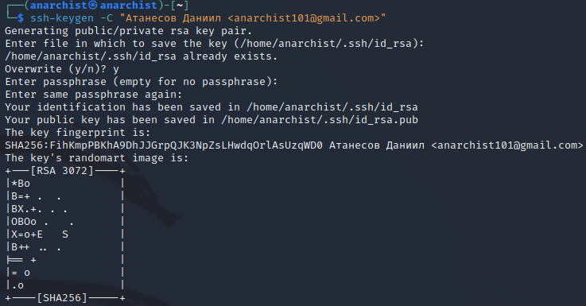{ #fig:006 width=90% }

7) Далее загружаем сгенерённый открытый ключ на сайте 

http://github.org/ под своей учётной записью и переходим в меню Setting . После этого выбираем в боковом меню SSH and GPG keys и нажимем кнопку New SSH key. Далее копируем из локальной консоли ключ в буфер

обмена. 

8) Вставляем ключ в появившееся на сайте поле и указываем для ключа имя(Title).

{ #fig:007 width=90% }

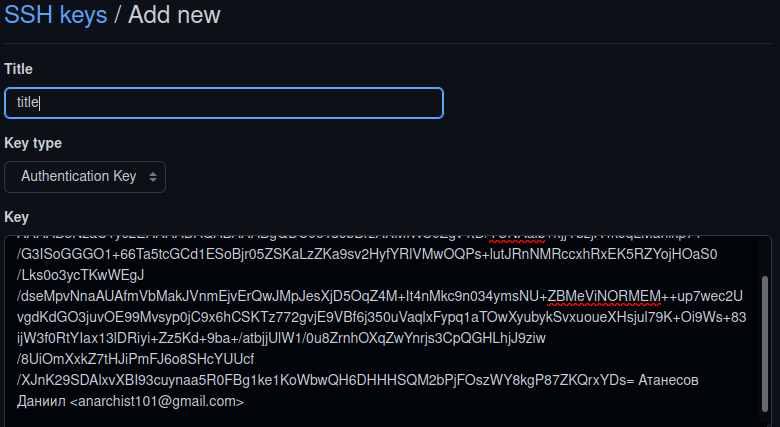{ #fig:008 width=90% }

9) Открываем терминал и создаём каталог для предмета «Архитектура компьютера». 

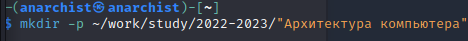{ #fig:009 width=90% }

10) Переходим в репозиторий [https://github.com/yamadharma/course-directory-student- template ](https://github.com/yamadharma/course-directory-student-template)и выбираем Use this template. 

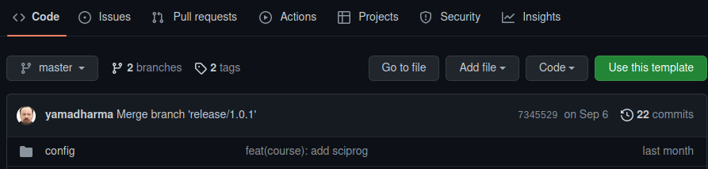{ #fig:010 width=90% }

11) Задаём имя репозиторию и создаём репозиторий. 

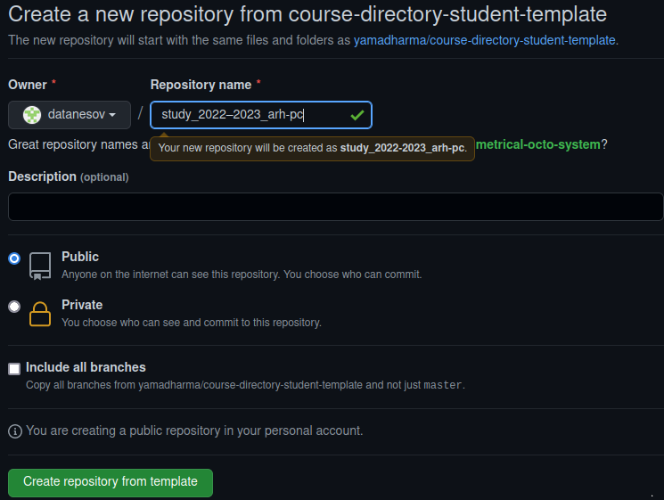{ #fig:011 width=90% }

12) Открываем терминал и переходим в каталог курса.

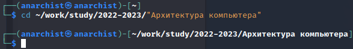{ #fig:012 width=90% }

13) Далее копируем ссылку для клонирования созданного репозитория.

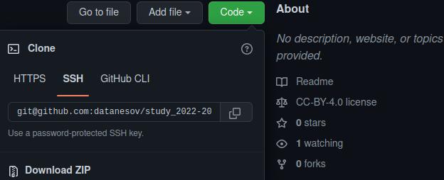{ #fig:013 width=90% }

14) Клонируем созданный репозиторий.

{ #fig:014 width=90% }

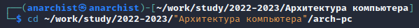{ #fig:015 width=90% }

15) Переходим в каталог курса.

{ #fig:016 width=90% }

16) Удаляем лишние файлы. 

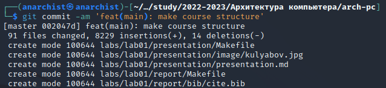{ #fig:017 width=90% }

17) Создаём необходимые каталоги.

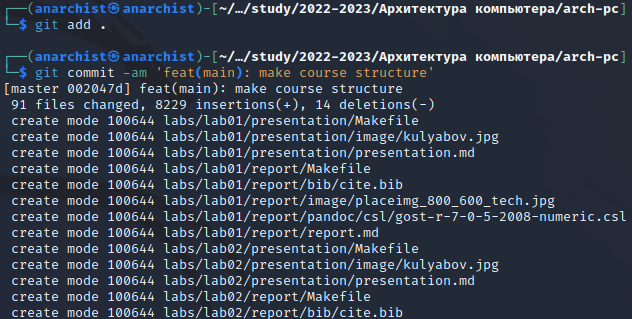{ #fig:018 width=90% }

18) Отправляем файлы на сервер.

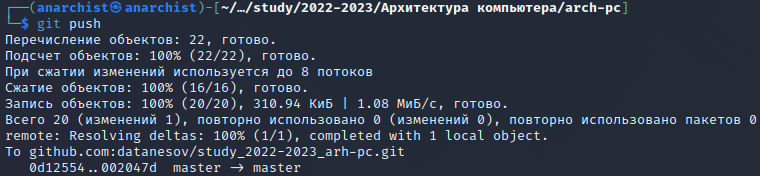{ #fig:019 width=90% }

19) Проверяем правильность создания иерархии рабочего пространства в локальном репозитории и на странице github. 

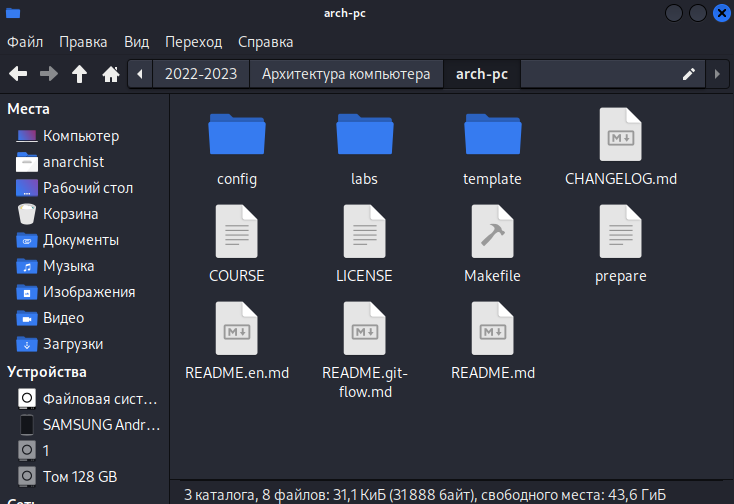{ #fig:020 width=90% }

# Выводы
Выполнив данную лабораторную рабботу я научился и изучил идеологию и приминение средств контроля версий, приобрел практические навыки по работе с системой git

# Список литературы{.unnumbered}

::: {#refs}
:::
